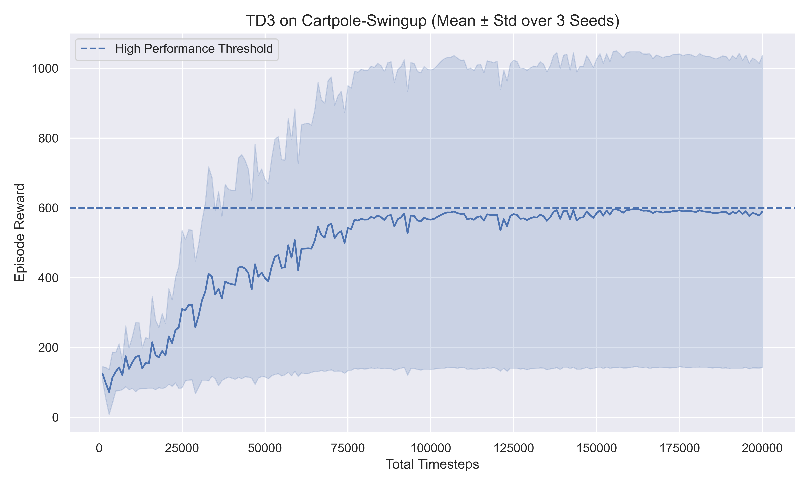

TD3 on CartPole-Swingup — Reinforcement Learning Project

This repository contains my implementation of the Twin Delayed Deep Deterministic Policy Gradient (TD3) algorithm applied to the CartPole-Swingup task from the DeepMind Control Suite (DMC).
The assignment requires training using seeds 0, 1, 2, evaluation using seed 10, and plotting the mean ± standard deviation learning curve.

🚀 Project Overview

This project solves the CartPole-Swingup task, where the pole starts in the downward position and must be swung up and stabilized.
The environment is continuous-control, making it well-suited for actor–critic algorithms like TD3.

Why TD3?

TD3 improves upon DDPG through:

Twin Q-networks → reduces overestimation

Delayed policy updates → stabilizes learning

Target policy smoothing → improves robustness

Deterministic policy with action noise for exploration

🧠 Algorithm: Twin Delayed Deep Deterministic Policy Gradient (TD3)

TD3 is a deterministic actor–critic method designed for continuous action spaces.

🟦 Key Features:

Twin Q-functions to fix overestimation

Target policy smoothing (σ = 0.2, clipped to 0.5)

Delayed actor updates (actor updates less frequently)

Deterministic actor, exploration via NormalActionNoise

🛠️ Installation
1. Create and activate a conda environment
conda create -n RLassign python=3.10
conda activate RLassign

2. Install dependencies
pip install stable-baselines3[extra]
pip install gymnasium
pip install "gymnasium[other]"
pip install dm_control
pip install seaborn matplotlib moviepy

Note: moviepy is required for video recording.

🎯 Training

Run the training script:

python train.py

This will:

Train TD3 on seeds 0, 1, 2

Save logs in logs/seed_X.monitor.csv

Save models in weights/td3_cartpole_seedX.zip

Training Code Snippet (from train.py)
action_noise = NormalActionNoise(
    mean=np.zeros(n_actions),
    sigma=0.1 * np.ones(n_actions)
)

model = TD3(
    "MultiInputPolicy",
    env,
    action_noise=action_noise,
    seed=seed,
    device="cuda:0",
    verbose=1,
)
model.learn(total_timesteps=200000)

🎥 Evaluation

Evaluate using seed 10 and record videos:

python eval.py

Videos will be saved inside:

📊 Learning Curve

You can generate the mean ± std plot using the notebook:

plot.ipynb

or directly from the provided Python plotting script.

Final Plot (TD3 – Mean ± Std over 3 Seeds)

⚙️ Hyperparameters
Parameter	Value
Algorithm	TD3
Learning Rate	3e-4
Batch Size	256
Buffer Size	1e6
Discount Factor (γ)	0.99
Tau	0.005
Policy Noise	0.2
Noise Clip	0.5
Action Noise	0.1
Network Architecture	[256, 256]
Activation	ReLU
Timesteps	200,000 per seed

📈 Results Summary

TD3 successfully swings up the pole and stabilizes it.

Final performance stabilizes around 600–650 reward.

Standard deviation decreases over time → stable learning across seeds.

Deterministic policy + action noise worked well despite SAC being more common for this environment.